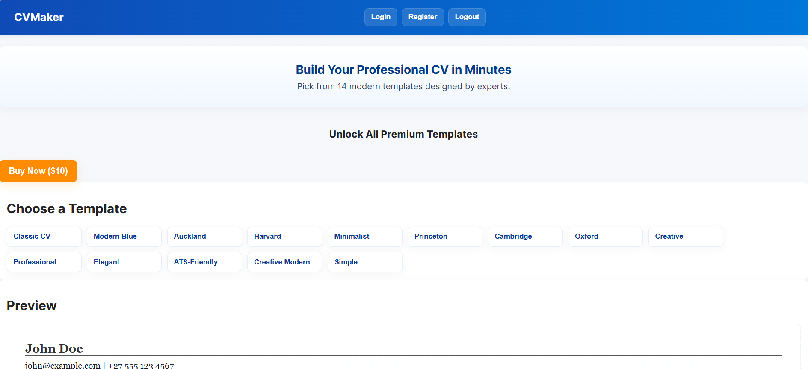
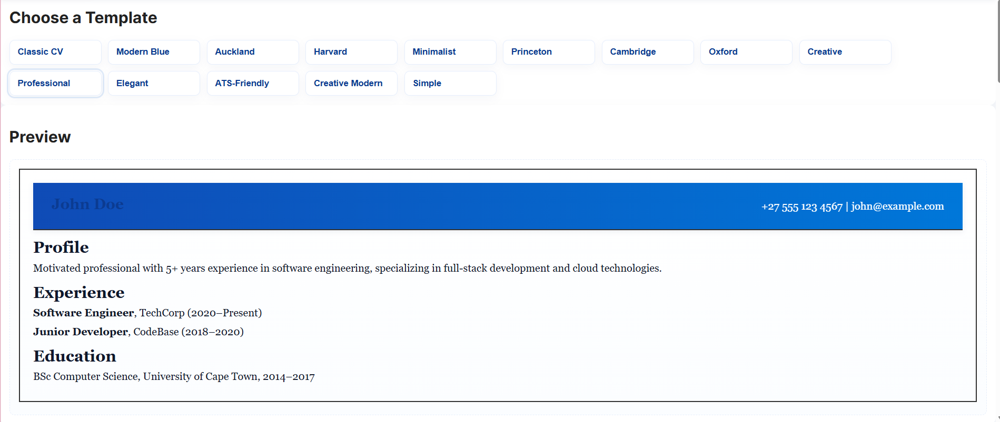
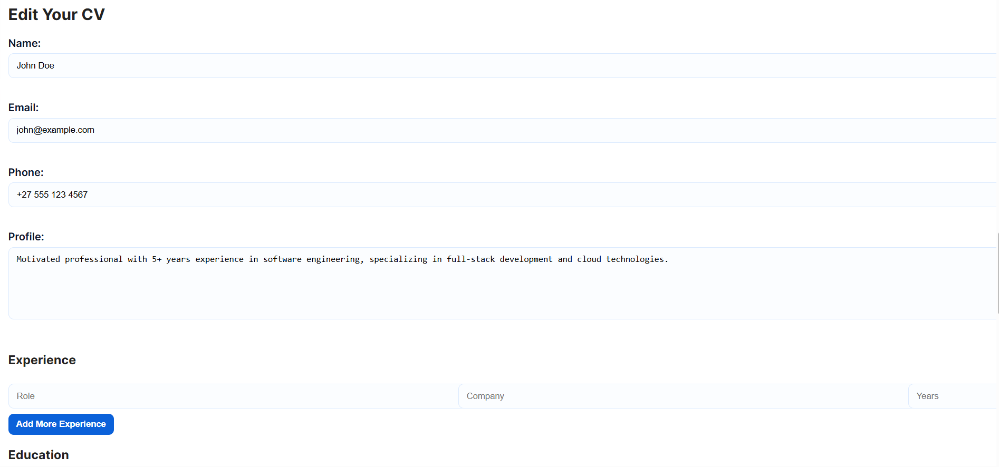
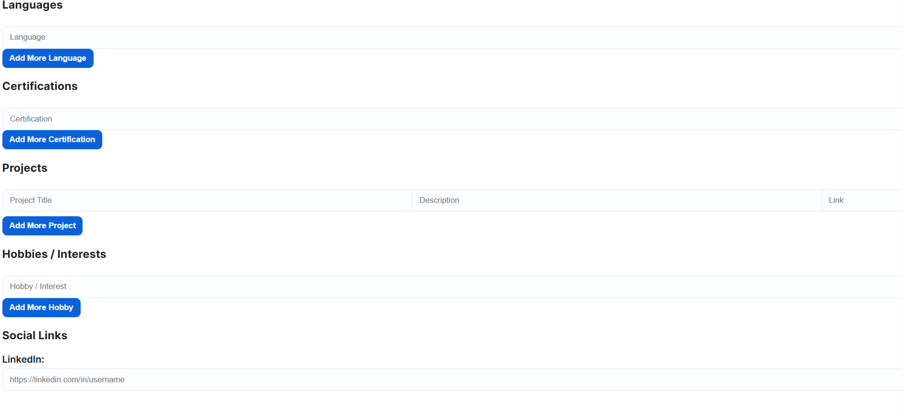

# cvv

A simple and user-friendly CV (Curriculum Vitae) Maker built to help users quickly create professional CVs by filling in a form and generating a structured output.

---

##  About the Project

The CV Maker App allows users to input their personal details, education, skills, and experience, then automatically generates a clean and organized CV layout.

This project was built as part of my learning journey in web development to improve my skills in JavaScript, HTML, and CSS.

---

##  Features

- Personal Information Input (Name, Contact, Email)
-  Education Section
-  Work Experience Section
-  Skills Section
-  Live CV Preview
-  Download/Export CV (if implemented)
-  Clean and responsive design

---

## Technologies Used

- HTML
- CSS
- JavaScript (DOM Manipulation)
- JSON

---

##  Preview









## 📁 How to Run the Project

1. Clone the repository:
```bash
git clone https://github.com/your-username/cv-maker.git
